# 🚀 XP Tracking Discord Bot

<div align="center">


*An intelligent Discord bot that automatically tracks and awards XP based on user activities, powered by AI and integrated with Notion for seamless data management.*

</div>

## ✨ Features

- 🤖 **AI-Powered XP Detection**: Uses Google's Generative AI to intelligently analyze messages and determine XP-worthy activities
- 📊 **Notion Integration**: Seamlessly stores and manages XP data in Notion databases
- 🔍 **Vector Database**: Utilizes FAISS for efficient similarity search and activity matching
- 🐳 **Containerized**: Fully containerized with Docker for easy deployment
- ⚡ **Real-time Processing**: Instant message processing and XP awarding
- 📱 **Discord Integration**: Native Discord.js v14 integration with modern slash commands support

## 🏗️ Project Architecture

```
xp-discord-bot/
├── src/
│   ├── index.ts                 # Application entry point
│   ├── discord/
│   │   └── DiscordBot.ts       # Discord bot implementation
│   ├── notion/
│   │   └── NotionClient.ts     # Notion API integration
│   ├── ai/
│   │   └── AIProcessor.ts      # Google AI processing
│   └── vector/
│       └── VectorDB.ts         # FAISS vector database
├── docker-compose.yml          # Container orchestration
├── Dockerfile                  # Container build instructions
├── package.json                # Dependencies and scripts
├── tsconfig.json              # TypeScript configuration
└── .env.example               # Environment variables template
```

## 🚀 Quick Start

### Prerequisites

Before you begin, ensure you have the following installed:

- **Node.js** (v18 or higher) - [Download here](https://nodejs.org/)
- **npm** or **yarn** - Comes with Node.js
- **Docker** (optional, for containerized deployment) - [Download here](https://www.docker.com/)
- **Discord Application** - [Create one here](https://discord.com/developers/applications)
- **Notion Integration** - [Set up here](https://developers.notion.com/)
- **Google AI API Key** - [Get one here](https://ai.google.dev/)

### 🔧 Installation

1. **Clone the repository**
   ```bash
   git clone <repository-url>
   cd dappi-beta
   ```

2. **Install dependencies**
   ```bash
   npm install
   ```

3. **Environment Configuration**
   ```bash
   cp .env.example .env
   ```
   
   Fill in your `.env` file with the required credentials:
   ```env
   DISCORD_TOKEN=your_discord_bot_token
   NOTION_API_KEY=your_notion_integration_token
   NOTION_DATABASE_ID=your_notion_database_id
   GOOGLE_AI_API_KEY=your_google_ai_api_key
   ```

4. **Development Mode**
   ```bash
   npm run dev
   ```

### 🐳 Docker Deployment

For production deployment using Docker:

```bash
# Build and start the container
docker-compose up --build

# Run in background
docker-compose up -d --build

# View logs
docker-compose logs -f

# Stop the container
docker-compose down
```

## 🛠️ Available Scripts

| Script | Description |
|--------|-------------|
| `npm run dev` | Start development server with hot reload |
| `npm run build` | Build TypeScript to JavaScript |
| `npm start` | Start production server |
| `npm test` | Run test suite |

## 🔑 Configuration

### Discord Bot Setup

1. Go to [Discord Developer Portal](https://discord.com/developers/applications)
2. Create a new application
3. Navigate to "Bot" section
4. Create a bot and copy the token
5. Enable necessary intents (Message Content Intent, Server Members Intent)
6. Invite the bot to your server with appropriate permissions

### Notion Database Setup

1. Create a new Notion database with the following properties:
   - **User** (Title)
   - **Activity** (Rich Text)
   - **XP Awarded** (Number)
   - **Date** (Date)
   - **Discord ID** (Rich Text)

2. Share the database with your Notion integration

## 🤝 How It Works

1. **Message Detection**: Bot listens to Discord messages in configured channels
2. **AI Analysis**: Google's Generative AI analyzes message content for XP-worthy activities
3. **Vector Matching**: FAISS vector database matches activities against predefined criteria
4. **XP Calculation**: AI determines appropriate XP amount based on activity type and complexity
5. **Notion Storage**: XP data is stored in Notion database for persistence
6. **User Feedback**: Bot responds with XP award confirmation and current totals

## 🐛 Troubleshooting

### Common Issues

**ES Module Error**
```
Error: Must use import to load ES Module
```
*Solution*: This project uses ES modules. Ensure you're using the correct Node.js version (18+) and the updated scripts.

**Discord Permission Errors**
```
DiscordAPIError: Missing Permissions
```
*Solution*: Ensure your bot has the following permissions:
- Send Messages
- Read Message History
- Use Slash Commands

**Notion API Errors**
```
NotionAPIError: Unauthorized
```
*Solution*: Verify your Notion integration token and database sharing settings.

### Getting Help

- 📖 Check the [Discord.js Guide](https://discordjs.guide/)
- 🔍 Browse [Notion API Documentation](https://developers.notion.com/)
- 🤖 Review [Google AI Documentation](https://ai.google.dev/docs)

## 🤝 Contributing

We welcome contributions! Here's how you can help:

1. **Fork the repository**
2. **Create a feature branch** (`git checkout -b feature/amazing-feature`)
3. **Commit your changes** (`git commit -m 'Add amazing feature'`)
4. **Push to the branch** (`git push origin feature/amazing-feature`)
5. **Open a Pull Request**

### Development Guidelines

- Follow TypeScript best practices
- Add tests for new features
- Update documentation as needed
- Ensure Docker builds successfully

## 📄 License

This project is licensed under the MIT License - see the [LICENSE](LICENSE) file for details.

## 📞 Support

If you encounter any issues or have questions:

- 🐛 [Report a bug](../../issues/new?template=bug_report.md)
- 💡 [Request a feature](../../issues/new?template=feature_request.md)
- 💬 Join our [Discord community](https://discord.gg/your-server)

---

<div align="center">
Made with ❤️ by the Dappi Dev Team
</div>

## Sequence Diagram

```mermaid
sequenceDiagram
    participant Member as 🧑 Member
    participant DiscordBot as 🤖 DiscordBot
    participant VectorDB as 🧠 VectorDB
    participant NotionService as 📘 NotionService
    participant MessageTemplates as ✨ MessageTemplates

    Member->>DiscordBot: sends message tagging bot with XP-worthy description

    DiscordBot->>VectorDB: search(content)
    VectorDB-->>DiscordBot: topMatch (name, type, criterionId)

    alt No confident match
        DiscordBot-->>Member: "Could not match any XP criteria."
    else Match found
        DiscordBot->>NotionService: findMemberByUsername(usernames)
        NotionService-->>DiscordBot: member Notion IDs

        DiscordBot->>NotionService: awardXP(payload)
        NotionService-->>DiscordBot: success/failure

        DiscordBot->>MessageTemplates: getRandom()
        MessageTemplates-->>DiscordBot: "Nice work!"

        DiscordBot-->>Member: ✅ XP awarded for **{criterion}** to {usernames}
    end
```


## UML Diagram


