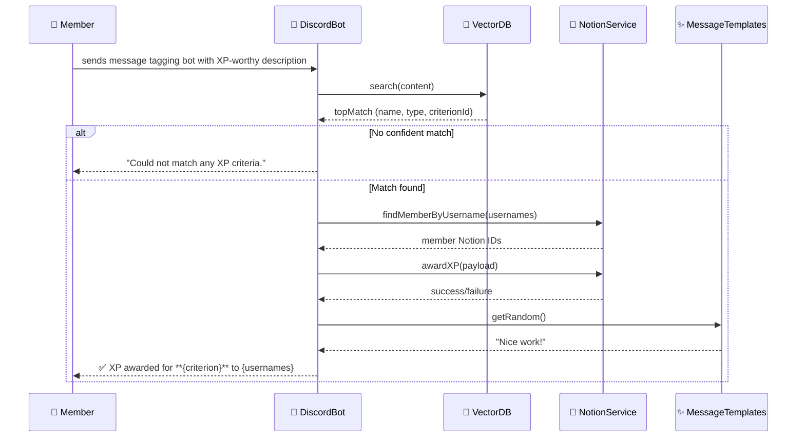

```mermaid
sequenceDiagram
    participant Member as 🧑 Member
    participant DiscordBot as 🤖 DiscordBot
    participant VectorDB as 🧠 VectorDB
    participant NotionService as 📘 NotionService
    participant MessageTemplates as ✨ MessageTemplates

    Member->>DiscordBot: sends message tagging bot with XP-worthy description

    DiscordBot->>VectorDB: search(content)
    VectorDB-->>DiscordBot: topMatch (name, type, criterionId)

    alt No confident match
        DiscordBot-->>Member: "Could not match any XP criteria."
    else Match found
        DiscordBot->>NotionService: findMemberByUsername(usernames)
        NotionService-->>DiscordBot: member Notion IDs

        DiscordBot->>NotionService: awardXP(payload)
        NotionService-->>DiscordBot: success/failure

        DiscordBot->>MessageTemplates: getRandom()
        MessageTemplates-->>DiscordBot: "Nice work!"

        DiscordBot-->>Member: ✅ XP awarded for **{criterion}** to {usernames}
    end
```