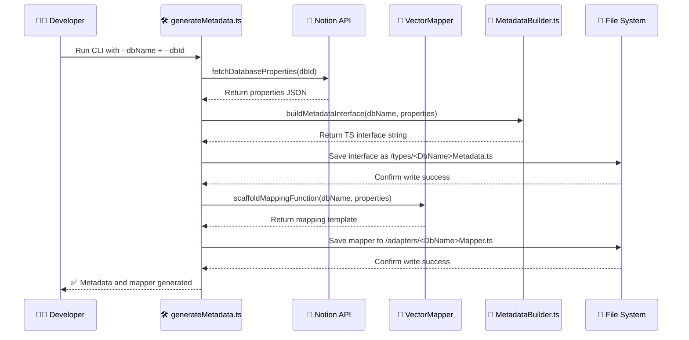

```mermaid
sequenceDiagram
  participant Dev as 👨‍💻 Developer
  participant CLI as 🛠️ generateMetadata.ts
  participant Notion as 🧠 Notion API
  participant Mapper as 🧩 VectorMapper
  participant Builder as 🧱 MetadataBuilder.ts
  participant FS as 📁 File System

  Dev->>CLI: Run CLI with --dbName + --dbId
  CLI->>Notion: fetchDatabaseProperties(dbId)
  Notion-->>CLI: Return properties JSON
  CLI->>Builder: buildMetadataInterface(dbName, properties)
  Builder-->>CLI: Return TS interface string
  CLI->>FS: Save interface as /types/<DbName>Metadata.ts
  FS-->>CLI: Confirm write success
  CLI->>Mapper: scaffoldMappingFunction(dbName, properties)
  Mapper-->>CLI: Return mapping template
  CLI->>FS: Save mapper to /adapters/<DbName>Mapper.ts
  FS-->>CLI: Confirm write success
  CLI-->>Dev: ✅ Metadata and mapper generated

```