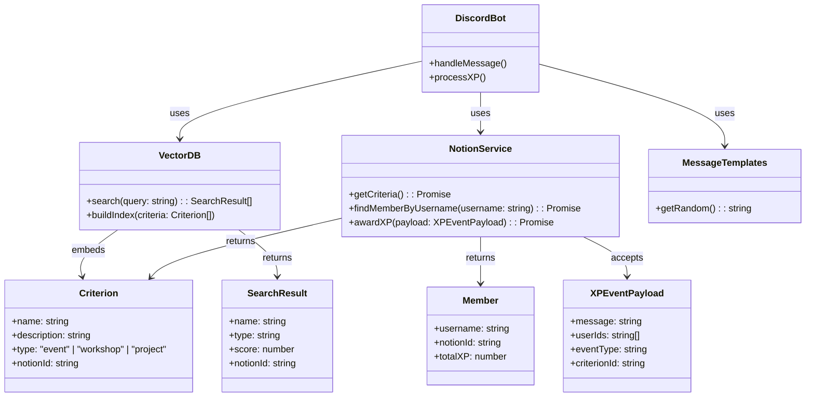

```mermaid
classDiagram
    class DiscordBot {
        +handleMessage()
        +processXP()
    }

    class VectorDB {
        +search(query: string): SearchResult[]
        +buildIndex(criteria: Criterion[])
    }

    class NotionService {
        +getCriteria(): Promise<Criterion[]>
        +findMemberByUsername(username: string): Promise<Member>
        +awardXP(payload: XPEventPayload): Promise<XPLogEntry>
    }

    class MessageTemplates {
        +getRandom(): string
    }

    class Criterion {
        +name: string
        +description: string
        +type: "event" | "workshop" | "project"
        +notionId: string
    }

    class Member {
        +username: string
        +notionId: string
        +totalXP: number
    }

    class XPEventPayload {
        +message: string
        +userIds: string[]
        +eventType: string
        +criterionId: string
    }

    class SearchResult {
        +name: string
        +type: string
        +score: number
        +notionId: string
    }

    DiscordBot --> VectorDB : uses
    DiscordBot --> NotionService : uses
    DiscordBot --> MessageTemplates : uses

    VectorDB --> Criterion : embeds
    VectorDB --> SearchResult : returns

    NotionService --> Criterion : returns
    NotionService --> Member : returns
    NotionService --> XPEventPayload : accepts
```